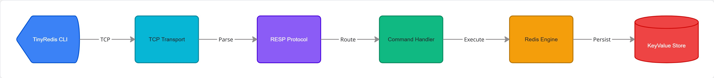

# TinyRedis

A lightweight Redis-like in-memory key-value server implemented in pure Java.

---

## Features

- **TCP server**: High-performance multi-threaded socket server
- **RESP protocol**: Redis Serialization Protocol parsing and encoding
- **Concurrent clients**: Safe multi-client concurrency handling
- **In-memory key-value storage**: Fast thread-safe storage engine
- **Redis-like CLI**: Interactive command-line terminal client
- **Time-To-Live (TTL)**: Automatic key expiration with EX/PX options
- **Memory Management**: Inline LRU (Least Recently Used) eviction policy
- **Basic commands**: `SET`, `GET`, `DEL`, `EXISTS`

---

## Architecture



```text
TinyRedis
├── Transport Layer      (TCP Server & Client Socket Handlers)
├── Protocol Layer       (RESP Parser & Response Encoder/Decoder)
├── Core Engine          (KeyValue Store & State Coordinator)
└── CLI                  (Interactive Terminal Client)
```

---

## ⚡ Performance & Cloud Benchmark

`TinyRedis v1.0.0` was evaluated under End-to-End (E2E) cloud benchmarks on **AWS EC2 (`c7i-flex.large`)** within an Intra-VPC high-speed network.

### 🚀 High-Speed Benchmark (AWS Private Network)

| Test Level | Concurrent Clients | Total Operations | Success Rate | Attempted QPS | Successful QPS | Median Latency (P50) | P99 Tail Latency |
| :--- | :---: | :---: | :---: | :---: | :---: | :---: | :---: |
| **Level 1** | 30 clients | 60,000 | **100.00%** | 33,727 QPS | 33,727 QPS | ⚡ **0.63 ms** | 3.24 ms |
| **Level 2** | 200 clients | 1,000,000 | **100.00%** | 🚀 **49,439 QPS** | 🚀 **49,439 QPS** | **2.82 ms** | 17.82 ms |
| **Level 3** | 500 clients | 2,500,000 | **100.00%** | 47,609 QPS | 47,609 QPS | 6.10 ms | 50.95 ms |
| **Level 4** | **1,000 clients** | **5,000,000** | **100.00%** | ⚡ **48,985 QPS** | ⚡ **48,985 QPS** | 9.46 ms | 110.56 ms |
| **Level 5** | 50 clients (500KB) | 200,000 | ❌ **1.89%** | 12,872 QPS | 243 QPS | 29.00 ms | 255.89 ms |

> 📖 **Full Engineering Report**: Read the complete breaking-point analysis, RCA, and latency percentiles in [BENCHMARK_REPORT.md](BENCHMARK_REPORT.md).

---


## Quick Start

### Prerequisites
- **Java 21** or higher
- **Maven 3.9+**

### Start Server

Build the project and start the server on default port `6379`:

```powershell
# Build project
mvn clean compile

# Start server
mvn exec:java -pl tinyredis-server
```

### Start CLI

In a new terminal window, connect to the running server:

```powershell
mvn exec:java -pl tinyredis-cli
```

---

## Supported Commands

| Command  | Syntax             | Description                                     | Return Value               |
|----------|--------------------|-------------------------------------------------|----------------------------|
| `SET`    | `SET key value [EX seconds] [PX millis]` | Set key to hold string value (with optional TTL) | `OK`                       |
| `GET`    | `GET key`          | Get the value of key                            | Value string or `(nil)`    |
| `EXISTS` | `EXISTS key`       | Returns if key exists                           | `1` (exists) or `0`        |
| `DEL`    | `DEL key`          | Removes the specified key                       | `1` (deleted) or `0`       |

---

## Example

```text
tiny-redis:6379> SET name JohnDoe
OK

tiny-redis:6379> GET name
JohnDoe

tiny-redis:6379> EXISTS name
1

tiny-redis:6379> DEL name
1

tiny-redis:6379> GET name
(nil)

tiny-redis:6379> quit
```

---

## Project Structure

```text
tiny-redis
├── tinyredis-core        # Memory engine & thread-safe KeyValueStore
├── tinyredis-protocol    # RESP protocol parser, Command & Response models
├── tinyredis-server      # TCP socket server, multithreaded ConnectionHandler
├── tinyredis-cli         # Interactive terminal CLI client
└── docs/images           # Documentation assets and diagrams
```

---

## Roadmap

### v1.0
- Core TCP Server & multi-threaded socket handling
- RESP protocol parser and encoder/decoder
- In-memory KeyValueStore (`SET`, `GET`, `DEL`, `EXISTS`)
- Interactive CLI client (`tinyredis-cli`)

### v1.1 (Released)
- ✅ Expiration (TTL & MinHeap priority queue expiration engine)
- ✅ LRU memory eviction policy

### v1.2
- Persistence (Write-Ahead Log & Snapshot Manager)

### v2.0
- Distributed cache & replication support
